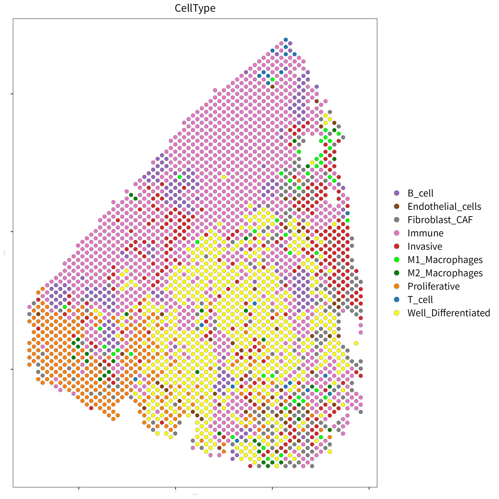

# Giotto Annotation

　This step doing PAGE Annotations

## 1.required package

The following R packages are required for this STEP: Note that Giotto only works with v1.x.x.

1. Giotto （ver 1）
2. patchwork
3. ggplot2

## 2.Input file

1. Spaceranger output.
2. Geneset file.
3. Colour list.

The Geneset file to be loaded is a tab-delimited file containing the gene name and celltype as shown below.

``` txt:../demo_data/PAGE_genesets.txt
Gene    Celltype
IGKC    Immune
IGHG1   Immune
IGHA1   Immune
JCHAIN  Immune
....
```

The Colour file to be loaded is a tab-delimited file containing cell types and colour codes as follows.The celltype names in "CelltypeCol.txt" must match those in PAGE_genesets.

``` txt:../demo_data/CelltypeCol.txt
CellType            col
Well_Differentiated "#FFFF00"
Proliferative       "#ff7f0e"
Invasive            "#d62728"
....
```

## 3.Analysis cide

``` R:Giotto_analysis.r
library(Giotto)
library(patchwork)
library(ggplot2)
set.seed(1234)

SRanger <-"../demo_data/Spaceranger/" # path to space ranger output 
Dir     <-"test" # output dir name
Pname   <-"test" # sample name
```

If the output directory does not exist, create it.
A directory named fig is required under the output directory.

```　R:Giotto_analysis.r
temp_dir = paste0(Dir,"/fig")
dir.create(Dir)
dir.create(temp_dir)
```

First read the gene set files to be used for annotation.

```　R:Giotto_analysis.r
cellMaker <- read.table("../demo_data/PAGE_genesets.txt" , sep="\t" , header= T )
```

Next, load a file specifying the colour of each Celltype in the Plot.
The celltype names in CelltypeCol.txt must match those in PAGE_genesets.

```R:Giotto_analysis.r
typeCol <- read.table("../demo_data/CelltypeCol.txt" , sep="\t" , header= T )
col_names <-  typeCol$col
names(col_names) <-  typeCol$CellType
```

Create a Giotto object.

```　R:Giotto_analysis.r
instrs = createGiottoInstructions(
                save_dir = temp_dir ,
                save_plot = TRUE , 
                show_plot = FALSE
         )

GiottoOBJ = createGiottoVisiumObject(
                visium_dir = SRanger , 
                expr_data = 'raw',
                png_name = 'tissue_lowres_image.png',
                gene_column_index = 2, instructions = instrs
            )
```

Filtering of spot and normalisation of expression.

```　R:Giotto_analysis.r
metadata = pDataDT(GiottoOBJ)
in_tissue_barcodes = metadata[in_tissue == 1]$cell_ID
GiottoOBJ = subsetGiotto(GiottoOBJ, cell_ids = in_tissue_barcodes)

## filter
GiottoOBJ <- filterGiotto(gobject = GiottoOBJ,
                              expression_threshold = 1,
                              gene_det_in_min_cells = 1,
                              min_det_genes_per_cell = 10,
                              expression_values = c('raw'),
                              verbose = T
                         )

## normalize
GiottoOBJ <- normalizeGiotto(
                gobject = GiottoOBJ, 
                scalefactor = 10000, verbose = T
             )
```

Check whether the genes contained in the geneset used for PAGE annotation are present in the Giotto obj, and
Exclude genes that are not present in the object.

``` R:Giotto_analysis.r
gene_metadata = fDataDT(GiottoOBJ)
cellMaker[ !cellMaker$Gene %in% gene_metadata$gene_ID  , ]
cellMaker <- cellMaker[ cellMaker$Gene %in% gene_metadata$gene_ID  , ]
```

``` R:Giotto_analysis.r
sign_list <- list()
for(i in unique(cellMaker$CellType) ) {
    sign_list <- c( sign_list , list(cellMaker[cellMaker$CellType == i ,1 ] ))    
}

signature_matrix = makeSignMatrixPAGE(
                    sign_names = unique(cellMaker$CellType),
                    sign_list =sign_list
                )

GiottoOBJ = runPAGEEnrich(
                gobject = GiottoOBJ,
                sign_matrix = signature_matrix ,
                min_overlap_genes =2
            )

cell_types = colnames(signature_matrix)

spatCellPlot(
                gobject = GiottoOBJ,
                spat_enr_names = 'PAGE',
                cell_annotation_values = cell_types,
                cow_n_col = 3,
                coord_fix_ratio = NULL,
                point_size = 0.75,
                save_param = list(
                    save_name="7_b_spatcellplot_1",
                    base_width = 12,
                    base_height = 12
                )
            )
````


The CellType with the highest scoring category in each spot is adopted and annotated.

``` R:Giotto_analysis.r
Annot <- as.data.frame(GiottoOBJ@spatial_enrichment$PAGE)
Annot$CellType <- apply( Annot,1,function(x){  names(x)[which.max(x)] })
GiottoOBJ@cell_metadata$CellType <-  Annot$CellType

p <- spatPlot2D(
        gobject = GiottoOBJ,
        cell_color  ="CellType",
        show_image = F,
        point_alpha = 1 ,
        point_size = 2.3 ,
        axis_text =1 ,
        axis_title = 1,
        legend_symbol_size = 3,
        legend_text = 12,
        cell_color_code=col_names
    )

filePath <- paste0(Dir,"/Image_Annotation_", Pname ,".pdf")
ggsave(file = filePath, plot = p, dpi=100, width=5, height=5)

File <-paste0(Pname,"_PAGEscore.txt") 
write.table( 
            Annot   ,
            file=File ,
            sep="\t" ,
            col.names=NA ,
            row.names=T ,
            quote=F
           )
```



## 4.Output file

`*_PAGEscore.txt` file is the score calculated with the ID and PAGE of each SPOT as follows
values calculated in PAGE and the adopted Annotation Cell type are listed in tab-delimited format as follows.

This file is used in the subsequent STEPs.

``` txt:_PAGEscore.txt
    cell_ID             B_cell              Endothelial_cells  .... CellType
1   AAACAAGTATCTCCCA-1  -0.422630857896381  2.64294498886797        Immune
2   AAACAGAGCGACTCCT-1  -2.10638734283724   1.36781146417301        Immune
3   AAACATTTCCCGGATT-1  -5.21185737130039   -0.566998735288874      Proliferative
```
