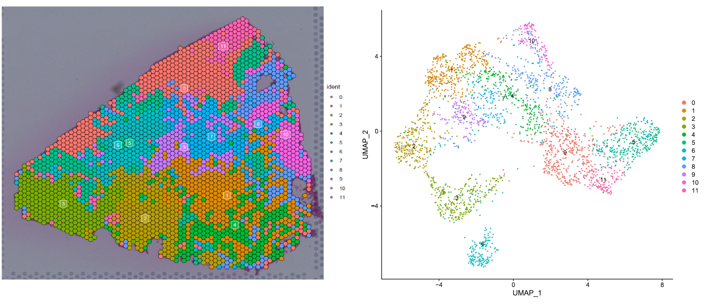

# STEP 2. Clustering analysis by Seurat & trajectory analysis by Monocle3.

## 1. Required packages

1. Seurat (v4)
2. monocle3 (v1)
3. ggplot2
4. patchwork
5. dplyr
6. SeuratWrappers (github-tag:"79fe900")
7. magrittr

### ・Example of old packeges intstall

``` R
remotes::install_version("Seurat", "4.0.1", repos = c("https://satijalab.r-universe.dev", getOption("repos")))
remotes::install_github('satijalab/seurat-wrappers' , ref = "79fe900")
devtools::install_github('cole-trapnell-lab/monocle3',tag="1.0.0")
```

## 2. Input file

## 3. Analysis code

Load library.

``` R:Seurat_Moncole.R
library(Seurat)
library(ggplot2)
library(patchwork)
library(dplyr)
library(SeuratWrappers)
library(monocle3)
library(magrittr)
set.seed(1234)
```

Creast Seurat obj, normalization and clustering.

``` R:Seurat_Moncole.R
# Seurat
lung <- Load10X_Spatial(data.dir = "../demo_data/Spaceranger/")
lung <- subset(lung, subset = nFeature_Spatial > 0)
lung <- SCTransform(lung, assay = "Spatial", verbose = FALSE) %>%
            RunPCA( assay = "SCT") %>%
            FindNeighbors(dims = 1:30) %>%
            FindClusters() %>%
            RunUMAP(dims = 1:30)

# Check clsutering result
p1 <- SpatialDimPlot(lung, label = TRUE, label.size = 3)
p2 <- DimPlot(lung, reduction = "umap", label = TRUE)
p1 + p2
```

<div align="center">

</div>

``` R:Seurat_Moncole.R
cds <- as.cell_data_set(lung)
cds <- cluster_cells(cds)
cds <- learn_graph(cds)
```

From Seurat clustering results and gene expression patterns, determine a root cluster of the trajectory.
Here, cluster 9 was used as the root cluster and the psudotime was calculated by obtaining the spot of the centre of gravity of cluster 9 as the root.

``` R:Seurat_Moncole.R

get_earliest_principal_node <- function(cds, time_bin = "9"){
  cell_ids <- which(colData(cds)[, "seurat_clusters"] == time_bin)
  closest_vertex <- cds@principal_graph_aux[["UMAP"]]$pr_graph_cell_proj_closest_vertex
  closest_vertex <- as.matrix(closest_vertex[colnames(cds), ])
  root_pr_nodes <- igraph::V(principal_graph(cds)[["UMAP"]])$name[as.numeric(names(which.max(table(closest_vertex[cell_ids,]))))]
  root_pr_nodes
}

rootcluster = 9
cds <- order_cells(
        cds, 
        root_pr_nodes=get_earliest_principal_node(cds,time_bin =rootcluster)
       )
p3 <- plot_cells(
            cds,
            color_cells_by = "seurat_clusters",
            label_groups_by_cluster = FALSE,
            label_leaves = FALSE,
            label_branch_points = FALSE
        )
p4 <- plot_cells(cds, color_cells_by = "pseudotime", label_groups_by_cluster = FALSE, label_leaves = FALSE, label_branch_points = FALSE)
p3+p4
```

<div align="center">

</div>

We estimated 2 paths as below.

PATH1: 9->6->3

PATH2: 9->10

These path is used in STEP 3-1 SPATA2 analysis.

