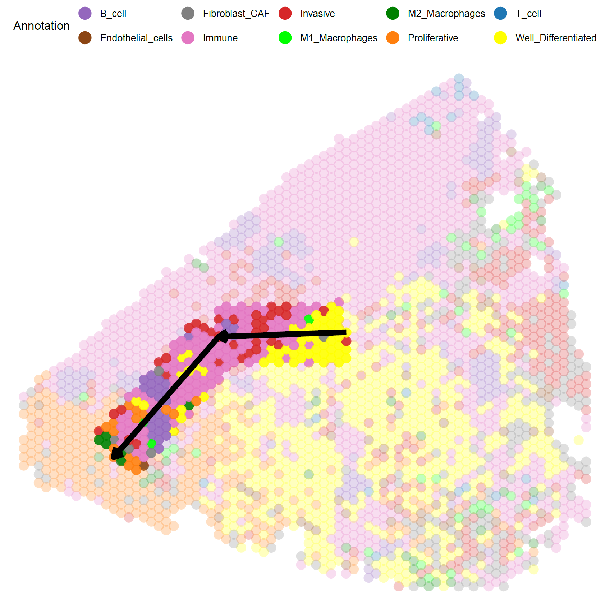
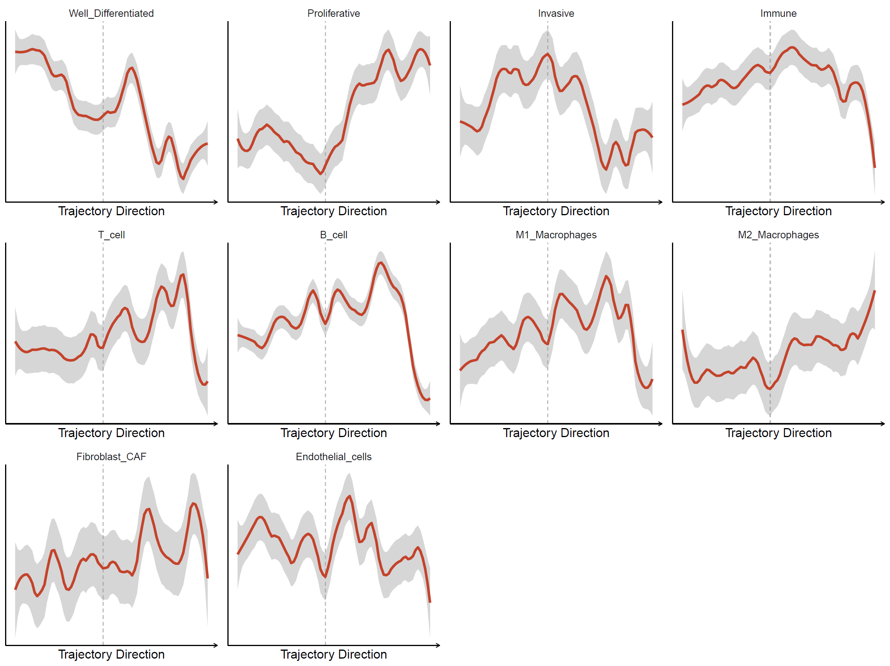
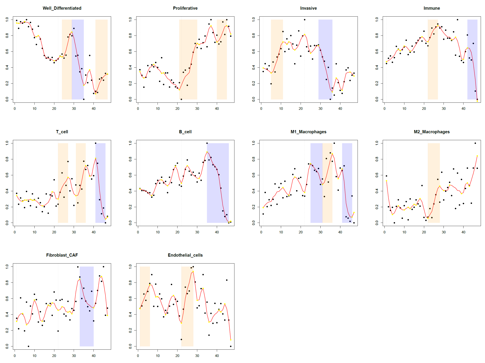
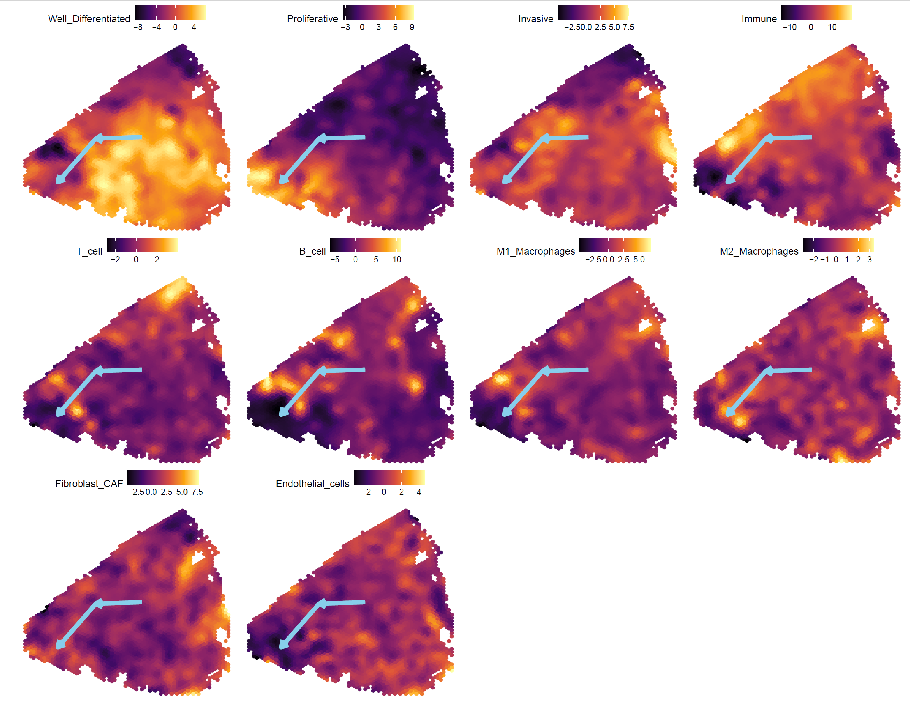
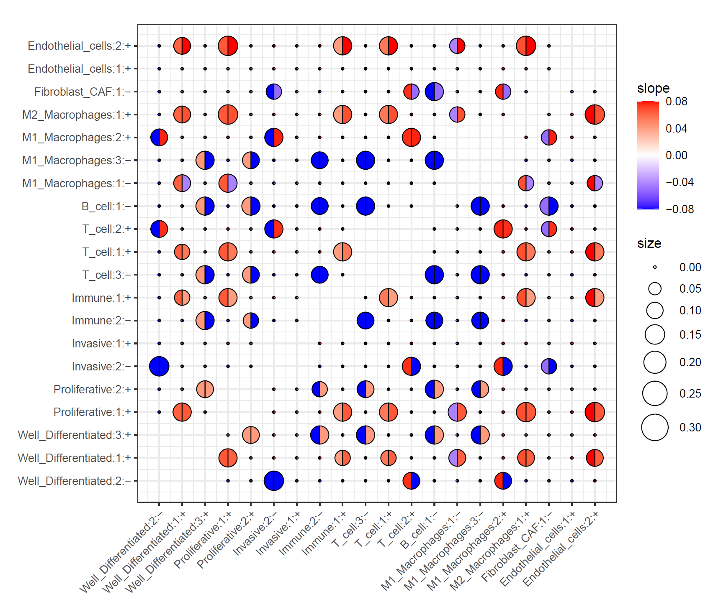

# STEP3-1: Evaluation of TME changes for IA cases

To evaluate changes in TME scores for IA cases, the scores were plotted along with the transcriptome trajectories by SATA

## 1.required package
1. tidyverse
2. Seurat (v4)
3. ggplot2
4. patchwork
5. SPATA2(0.1.0 or 1.0.0)


Installation old vaerion of SPATA2.

``` R
devtools::install_github(repo = "theMILOlab/SPATA2" , ref = "v1.0.0")
```

## 2.Input file

1. clustered Seurat OBJ.(like STEP2 or other)
2. PAGE score matix file (output of STEP1).

## 3.Analysis code

load packages.

``` R:SPATA.r
library(tidyverse)
library(Seurat)
library(ggplot2)
library(patchwork)
library(SPATA2)
set.seed(1234)
```

load custom functions.

``` R:SPATA.r
source("./Function-PlotTrraject.R")
```

load Seurat OBJ and result of STEP1 PAGE analysis.

``` R:SPATA.r
obj <- "../demo_data/lung_visium.rds"
project = "LUAD_No3B"  # name
PAGE_res <- "../STEP1_Giotto_PAGE/test_PAGEscore.txt"
SeuratOBJ <- readRDS(obj)

# Read PAGE Result
PAGE_inf <- read.delim( PAGE_res  ,header = T,stringsAsFactors=F ,sep="\t")
rownames(PAGE_inf) <- PAGE_inf$cell_ID
PAGE_inf <- PAGE_inf[ , c(-1,-2) ]

# Read Color Info
typeCol <- read.table("../demo_data//CelltypeCol.txt" , sep="\t" , header= T )
col_names <-  typeCol$col
names(col_names) <-  typeCol$CellType
Annotation<- factor(typeCol$CellType ,levels=typeCol$CellType)
```

Assign PAGE TME scores and annotation results to Seurat OBJ metadata.

``` R:SPATA.r
bc <- intersect( rownames(PAGE_inf) , rownames(SeuratOBJ@meta.data))
bc_order <- rownames(SeuratOBJ@meta.data)[ rownames(SeuratOBJ@meta.data) %in% bc  ]
## Add PAGE score to Seurat OBJ
for (i in c(1: (length(Annotation)  ) )  ) {
    Class =  as.character(Annotation[i])
    SeuratOBJ@meta.data[,Class] <- 0
    SeuratOBJ@meta.data[ bc_order ,Class ] <-  PAGE_inf[bc_order, Class]
}
SeuratOBJ@meta.data$Annotation <- PAGE_inf$CellType
```

Seurat obj is converted to SPATA obj.
Seurat also rotates the coordinates because the angle of the image is different from that of loupe and other objects.

``` R:SPATA.r
# Convert SPATA OBJ
spata_obj <- transformSeuratToSpata( 
                SeuratOBJ, 
                project,
                assay_name = 'Spatial', 
                coords_from = "umap"
            )
spata_obj <- adjustDirectoryInstructions( 
                object = spata_obj,
                to = "spata_object", 
                directory_new = "spata-obj-test.RDS" 
            )

#Optional :  rotates the coordinates
coord_inf <- spata_obj@coordinates[[project]][,c(3,4)]
new_coord_inf <- t(apply( coord_inf  , 1 , Fun_lotate,do = -180  ))
new_coord_inf <- t(apply(coord_inf ,1,  function(x){ return(x* c(1,-1))})) # y軸対象変換
spata_obj@coordinates[[project]][,c(3,4)] <- new_coord_inf
```

![fig]
Calculate the centre of gravity of each cluster.

``` R:SPATA.r
center_list <- c()
all_clus <- unique( spata_obj@fdata[[project]][,"seurat_clusters"])
for ( i in all_clus  ) {
    cluster_cell <- spata_obj@coordinates[[project]][ spata_obj@fdata[[project]][,"seurat_clusters"] == i ,  ]
    center <-apply( cluster_cell[,c(3,4)],2,mean )
    center_id <-names(which.min(as.matrix(dist( rbind( center ,cluster_cell[,c(3,4)] ) ))[1,-1]))
    center_list <- c( center_list, center_id )
}
names(center_list) <- all_clus
```

Specify the Trajectory manually in SPATA2.
The order of the Trajectory specifies the spot of the centre of gravity of each cluster in the order of clusters inferred from the monocole3 results.


``` R:SPATA.r
Tname <-"P1" # Trajectory Name 
spata_obj <- createTrajectoryManually( 
                spata_obj ,
                trajectory_name = Tname ,
                start = as.vector( 
                    new_coord_inf[ as.numeric(center_list["9"]), ]
                    ) ,
                end   = as.vector( 
                    new_coord_inf[ as.numeric(center_list["3"]), ]
                ) ,
                vertices = list(
                    v1 =  as.vector( 
                        new_coord_inf[ as.numeric(center_list["6"]), ]
                    )
                ),
                width = 25,
                plot=T
            )

p<-plotTrajectory(object = spata_obj,
               trajectory_name = Tname,
               color_by = "Annotation",
               pt_alpha = 0.25, 
               display_image = FALSE
               ) + 
               legendTop() + 
               ggplot2::scale_color_manual( values = col_names )

filePath <- paste0("./Spatial_Trajectory", project,"_", Tname ,".pdf")
ggsave(file = filePath, plot = p, dpi=100, width=8, height=8)
```

Result of trajetory line.

<div align="center">

</div>


A custom function is then used to visualise the variation in each PAGE annotation score in the Trajetory pathway calculated by SPTAT and to explore the position in space where each factor's score changes.

Parameters for custom functions are explained later.

``` R:SPATA.r
slope_min <- 0.04
Make_SCCR(
            spata_obj= spata_obj ,
            PAGE_inf=PAGE_inf ,
            project=project,
            trajectory_name=Tname ,
            slope_min = slope_min ,
            span =0.2 ,
            overlap = 4 ,
            region_length =4 ,
            Annotation = Annotation
        )
```

Example: longer Trajectory PATH.

``` R:SPATA.r
Tname <-"Px" # Trajectory Name 
spata_obj <- createTrajectoryManually( 
                spata_obj ,
                trajectory_name = Tname ,
                start = as.vector( 
                    new_coord_inf[ as.numeric(center_list["9"]), ]
                    ) ,
                end   = as.vector( 
                    new_coord_inf[ as.numeric(center_list["3"]), ]
                ) ,
                vertices = list(
                    v1 =  as.vector( 
                        new_coord_inf[ as.numeric(center_list["6"]), ]
                    ),
                    v1 =  as.vector( 
                        new_coord_inf[ as.numeric(center_list["2"]), ]
                    ),
                    v1 =  as.vector( 
                        new_coord_inf[ as.numeric(center_list["1"]), ]
                    )
                ),
                width = 25,
                plot=T
            )
```

## 4.About Custom function Parameters

Make_SCCR( spata_obj,PAGE_inf,project,trajectory_name,slope_min,region_lengthPct ,
span =0.2 ,overlap = 5 , pw= 8,ph= 8,region_length = NULL,Annotation = NULL)

 - spata_obj ... SPATA object after calculating trajectories.
 - PAGE_inf  ... PAGE score matorix
 - project ... project name . this name used by ouput name
 - trajectory_name ... Trajectory name given as input to the SPTAT2 createTrajectoryManually() run.
 - slope_min == slope_min ... The lowest slope value in the distribution of trajectory scores calculated by SPTAT2 that is defined as having changed.
 - region_lengthPct ...  Defines the length of the region required to be defined as changed.
                         Greater than the total length of the region multiplied by the value of "region_lengthPct".
                         (If region_length is defined, this value is ignored).
 - span ... loess span
 - overlap ...
 - region_length ...
 - Annotation ... Plot PAGE Category
 - pw ... width of ouput pdf
 - ph ... height of ouput pdf


## 5.Output file

### Plot

 1. Spatial_Trajectory_\${NAME}_\${Tname}.pdf
   

   
   
 2. ALL_PAGE_Trajectory_\${NAME}_\${Tname}.pdf
   
   TME Score distribution of each feature and its landscape with the inferred trajectory.

   

 3. InflectionPoint_Trajectory_ScorePlot\${NAME}_\${Tname}.pdf
   
   TME Score distribution of each feature and its landscape with the inferred trajectory.
   The coloured areas are those where the TME score has changed. Orange is the area where the score increased, blue is the area where it decreased.

   

 4. ALL_PAGE_Heatmap_\${NAME}_\${Tname}.pdf
      
    TME score Heatmap.

   

 5. TJK_ovarlap_\${NAME}_\${Tname}.pdf
    
   


### Matrix txt file
 1. trajectory_score_matrix_\${NAME}_\${Tname}.txt
   
  - column1:ignored
  - column2:trajectory_part       -> Trajectory Part.
  - column3:trajectory_part_order -> distance from Trajectory part start.
  - column4:trajectory_order      -> distance from start in Trajectory-full.
  - column5-last:                 -> EachTME score.


 2. ScoreChangedRegoin_\${NAME}_\${Tname}.txt

TME pairs were extracted when the regions of each TME change overlapped on the same trajectory.

  - column1:ignored
  - column2:x_start    -> start potion of trajectory part.
  - column3:x_end      -> end potion of trajectory part.
  - column4:pos        -> increas(+) , decrese(-).
  - column5:Annotaion  -> TME score Annotation.
  - column6:sid        -> id of TME change region.
  - column7:slope      -> slope of TME score(Annotaiton) in TME change region.
  - column8:slope_ov   -> slope in the overlap region with annotation2.
  - column9:x_start2   -> start potion of trajectory part.
  - column10:x_end2    -> end potion of trajectory part.
  - column11:pos2      -> increas(+) , decrese(-).
  - column12:Annotaion2-> TME score Annotation(Annotation2).
  - column13:sid2      -> id of TME change region(Annotaiton2).
  - column14:slope2    -> slope of TME score(Annotaiton2) in TME change region.
  - column15slope_ov2  -> slope in the overlap region with annotation.
  - column16:overlap   -> length og overllap.


