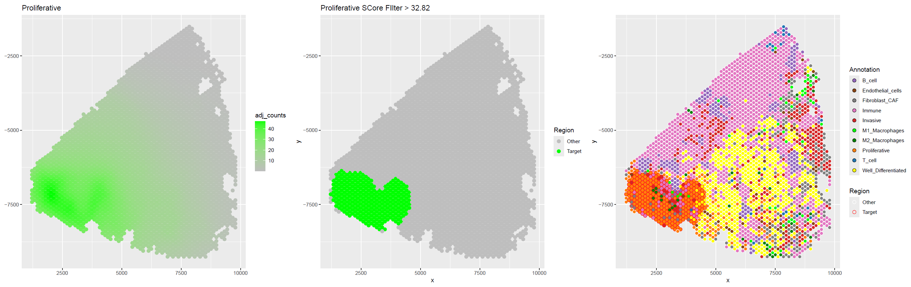
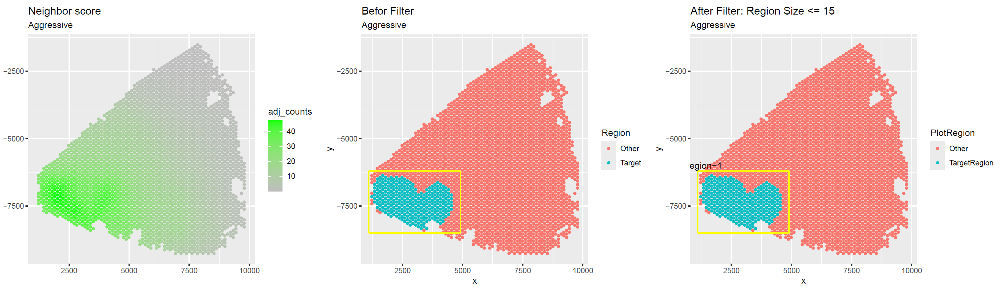
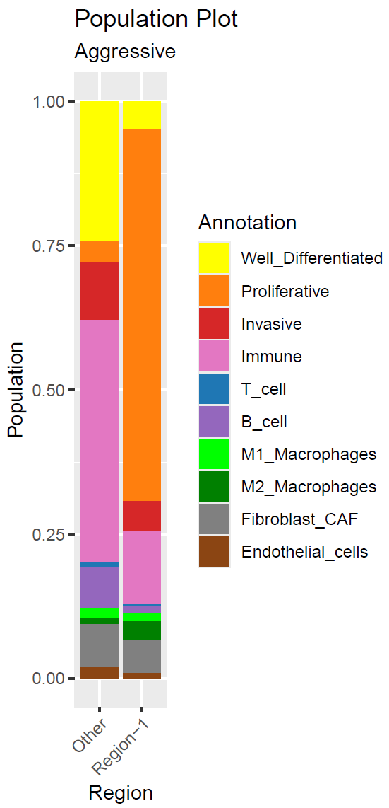
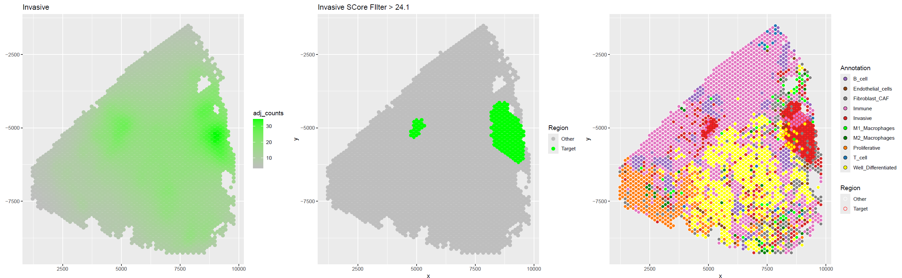
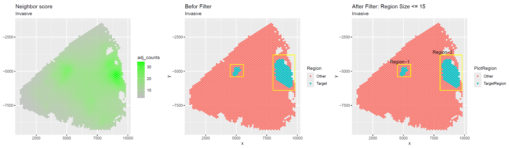
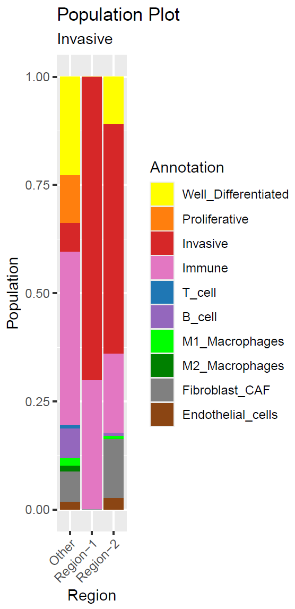

# Title

## 1.required package
1. tidyverse
2. Seurat (v4)
3. ggplot2
4. patchwork
5. dplyr
6. dbscan
7. tidyr
8. ggridges
9. sf


## 2.Input file

1. clustered Seurat OBJ.(like STEP2 or other)
2. PAGE score matix file (output of STEP1).

## 3.Analysis code

load packages.

``` R:PMregion_detection.r
library(dplyr)
library(Seurat)
library(ggplot2)
library(patchwork)
library(dbscan)
library(tidyr)
library(tidyverse)
library(ggridges)
library(sf)
set.seed(1234)

```

load custom functions.

``` R:PMregion_detection.r
source("Function_plotModule.r")
```

load Seurat OBJ and result of STEP1 PAGE analysis.

``` R:PMregion_detection.r
Sample <- "test"
obj           <- paste0("../demo_data/lung_visium.rds" )
PAGE_inf.file <- paste0("../STEP1_Giotto_PAGE/test_PAGEscore.txt")
typeCol       <- read.table("../demo_data/CelltypeCol.txt" , sep="\t" , header= T )
SeuratOBJ     <- readRDS(obj)
PAGE_inf      <- read.table(PAGE_inf.file , sep="\t" , header= T , row.names=1)
rownames(PAGE_inf) <- PAGE_inf$cell_ID

```

Create a matrix of coordinate information for each spot and add a TME score.

``` R:PMregion_detection.r
# spot coordinates matrix
mat.dt     <- SeuratOBJ@images$slice1@coordinates %>%
                select( c(imagecol,imagerow)) %>%
                as.data.frame
mat.dt     <- mat.dt[ rownames(PAGE_inf) , ]
mat.dt[,2] <- mat.dt[,2]*(-1) # conver angel
colnames(mat.dt) <- c("x","y")
mat.dt <-cbind(mat.dt, PAGE_inf) # add TME score
PAGE_inf <- PAGE_inf[ , c(2:(ncol(PAGE_inf)-1 ) ) ]

col_names        <- typeCol$col
names(col_names) <- typeCol$CellType
```

Check the distribution of pixel distances between SPOTs.

``` R:PMregion_detection.r
forCheckSpotDist <- frNN(x= mat.dt[,c("x","y")], eps =2000)
summary(unlist( lapply(forCheckSpotDist$dist,min) ))

   Min. 1st Qu.  Median    Mean 3rd Qu.    Max.
  131.0   131.0   131.0   131.0   131.0   228.1
```

Here, the radius size (tmp_eps) is set to 134 to allow a little leeway.
This dataset is calculated as 134 / 266 (FF No1~No3 is 266, others are 134).


``` R:PMregion_detection.r
max_step =35
tmp_eps <- 134 # 要確認
cate_num <- length( names(col_names))
```

As the radius is extended, the cumulative values are calculated by weighting the surrounding TMEscore by distance.
However, it is the aggregate value at the largest radius that is used in the analysis.

``` R:PMregion_detection.r
nnCounts_list  <-c()
for (size_c in c(1:max_step)){
    eps <- tmp_eps * size_c
    nn_data <- frNN(x= mat.dt[,c("x","y")], eps = eps)
    tmp_data<- lapply(
                rownames(mat.dt) ,
                RegionScore ,
                nn_data = nn_data ,
                mat.dt =mat.dt,
                tmp_eps = tmp_eps,
                size_c= size_c ,
                col_names = col_names
                )
    nnCounts_list  <- rbind(nnCounts_list , do.call(rbind ,tmp_data ) )
}

nnCounts_list <- nnCounts_list %>%
                 mutate(
                    x = mat.dt[ID , "x" ] ,
                    y = mat.dt[ID , "y" ] ,
                    Annotation = mat.dt[ID , "CellType" ]
                 )

```

Extract the spots whose Enrichment score exceeds the threshold value.
The threshold is set at 70% of the spots with the highest score (weight=0.7).
However, the lower limit is set to 10 (lowlim=10).

Calculate for "Proliferative".

``` R:PMregion_detection.r
weight= 0.7
lowlim = 10
```

``` R:PMregion_detection.r
PlotAnnotation <- "Proliferative"
max_score <- nnCounts_list %>%
             filter(CellType == PlotAnnotation ) %>%
             select(adj_counts) %>%
             max

threshold = ifelse(
                max_score * weight > lowlim ,
                round(max_score * weight, 2) ,
                lowlim
            )

Aggressive_plot_res <- makeRegionPlot(
                            nnCounts_list= nnCounts_list ,
                            col_names=col_names,
                            Plot_annotation=PlotAnnotation,
                            dot_size= 2.5,
                            p1_lowCol= "gray",
                            p1_highCol="green",
                            threshold = threshold,
                            max_step=35 ,
                            name = Sample ,
                            width=22 ,
                            height=7 ,
                            dpi=200
						)

```

Visualisation of the distribution of Enrichment scores and the SPOTs that have passed the filter.

<div align="center">

</div>

If there is more than one PM-region,
Manually enclose the island with four points to divide it and add flg.
Enter the coordinates of the four points in the freme_list and run.

  A = left_bottom ,
  B = left_top , 
  C = right_bottom,
  D = rite_top


``` R:PMregion_detection.r
dot_size=1.2
RegionMinSize = 15
```

``` R:PMregion_detection.r
# A = left_bottom ,B=left_top , C= right_bottom, D=rite_top
# A != D , B != C
frame_list <- list(
                list (  A= c(x = 1100 , y = -8500), 
						B= c(x = 1100 , y = -6200), 
						C= c(x = 4900 , y = -8500), 
						D= c(x = 4900 , y = -6200) 
					)
            )


Split_Res1<-PlotSplitRegion(
                frame_list=frame_list ,
                plot_res= Aggressive_plot_res ,
                name = Sample ,
                dot_size= dot_size,
                RegionMinSize = RegionMinSize ,
                Plot_annotation = "Aggressive",
                width=17,
                height=5,
                dpi=150 ,
                p1_lowCol="gray",
                p1_highCol="green" ,
                col_names = col_names
            )
```
<div align="center">


</div>


-----
Calculate for "Invasive".


``` R:PMregion_detection.r
PlotAnnotation <- "Invasive"
max_score <- nnCounts_list %>%
             filter(CellType == PlotAnnotation ) %>%
             select(adj_counts) %>%
             max

threshold = ifelse(
                max_score * weight > lowlim ,
                round(max_score * weight, 2) ,
                lowlim
            )

Invation_plot_res <- makeRegionPlot(
                            nnCounts_list= nnCounts_list ,
                            col_names=col_names,
                            Plot_annotation=PlotAnnotation,
                            dot_size= 2.5,
                            p1_lowCol= "gray",
                            p1_highCol="green",
                            threshold = threshold,
                            max_step=35 ,
                            name = Sample ,
                            width=22 ,
                            height=7 ,
                            dpi=200)
```

<div align="center">

</div>


``` R:PMregion_detection.r

frame_list <- list(
				list (  A= c(x = 4500 , y = -5400),
						B= c(x = 4500 , y = -4500), 
						C= c(x = 5600 , y = -5400), 
						D= c(x = 5600 , y = -4500) 
					),
				list (  A= c(x = 8000 , y = -6400), 
						B= c(x = 8000 , y = -3800), 
						C= c(x = 9800 , y = -6400), 
						D= c(x = 9800 , y = -3800) 
					)
			)

Split_Res2<-PlotSplitRegion(
                frame_list=frame_list ,
                plot_res= Invation_plot_res ,
                name=Sample ,
                dot_size= dot_size,
                RegionMinSize = RegionMinSize ,
                Plot_annotation = PlotAnnotation,
                width=17,
                height=5,
                dpi=150 ,
                p1_lowCol="gray",
                p1_highCol="green" ,
                col_names = col_names
            )
```
<div align="center">


</div>


## 4.About Custom function Parameters

### RegionScore
``` R:p.r
RegionScore <- function( id_name , 
						 nn_data , 
						 mat.dt , 
						 tmp_eps , 
						 size_c , 
						 col_names 
				)
```
- id_name&ensp;->&ensp; Spot barcode.  
- nn_data&ensp;->&ensp; result of frNN().  
- mat.dt&ensp;->&ensp; spot coordinates matrix with TME score.  
- tmp_eps&ensp;->&ensp; tmp_eps.  
- size_c&ensp;->&ensp; tmp_eps * n.  
- col_names&ensp;->&ensp; TME subtypelist.  


### makeRegionPlot
``` R:p.r
makeRegionPlot <- function(
                        nnCounts_list ,
                        col_names,
                        Plot_annotation ,
                        dot_size=2 ,
                        p1_lowCol="gray",
                        p1_highCol="green",
                        threshold =15 ,
                        max_step=35 ,
                        name="Sample",
                        width=17,
                        height=5,
                        dpi=100
					)
```

- nnCounts_list &ensp;->&ensp; result of RegionScore().  
- col_names &ensp;->&ensp; TME subtype list.  
- Plot_annotation &ensp;->&ensp; plot Target TME annotation name.  
- dot_size &ensp;->&ensp; plot dot size.  
- p1_lowCol &ensp;->&ensp; Low-scoring colours.  
- p1_highCol &ensp;->&ensp; High-scoring colours.  
- threshold &ensp;->&ensp; Lower limit of enrichment score.  
- max_step &ensp;->&ensp; Number of steps used for plotting.  
&ensp;&ensp;&ensp;&ensp;&ensp;&ensp;&ensp;&ensp;&ensp;&ensp;Recommended number of largest steps when creating nnCounts_list.  
- name &ensp;->&ensp; Sample name.  
- width &ensp;->&ensp; plot width.  
- height &ensp;->&ensp; plot height.  
- dpi &ensp;->&ensp; plot dpi.  


### PlotSplitRegion
``` R:p.r
PlotSplitRegion <-function(
                            frame_list ,
                            plot_res ,
                            name ,
                            dot_size=2,
                            RegionMinSize = 10 ,
                            Plot_annotation ,
                            width=17,
                            height=5,
                            dpi=100 ,
                            p1_lowCol="gray",
                            p1_highCol="green" ,
                            col_names
)
```

- frame_list &ensp;->&ensp; List containing four points in the area to be extracted.
- plot_res &ensp;->&ensp; result of makeRegionPlot().
- name &ensp;->&ensp; Sample name.  
- dot_size &ensp;->&ensp; plot dot size.  
- RegionMinSize &ensp;->&ensp; 
- Plot_annotation &ensp;->&ensp; plot Target TME annotation name.  
- width &ensp;->&ensp; plot width.  
- height &ensp;->&ensp; plot height.  
- dpi &ensp;->&ensp; plot dpi. 
- p1_lowCol &ensp;->&ensp; Low-scoring colours.  
- p1_highCol &ensp;->&ensp; High-scoring colours.  
- col_names &ensp;->&ensp; TME subtype list.  


## 5.Output file

### Plot
- PopulationPlot_Aggressive_\${NAME}.pdf  
- PopulationPlot_Invasive_\${NAME}.pdf  
- RegionFilterPlot_Aggressive_\${NAME}.pdf  
- RegionFilterPlot_Invasive_\${NAME}.pdf  
- Sub_DensityScorePlot_Invasive_\${NAME}.pdf  
- Sub_DensityScorePlot_Proliferative_\${NAME}.pdf  


### csv

calculated Enrichment score matrix at all spot。

- MetadataAddRegion_Aggressive_\${NAME}.csv  
- MetadataAddRegion_Invasive_\${NAME}.csv  


#### column 

  - column1:ignored
  - column2:CellType &ensp;->&ensp; Annotation category of the TME to be calculated.
  - column3:counts &ensp;->&ensp; Number of spots of the selected TME annotation category present around each spt.  
  - column4:adj_counts &ensp;->&ensp; Distance weighted normlize Count.
  - column5:ID &ensp;->&ensp; Spot ID. 
  - column11:x &ensp;->&ensp; X coordinate of each spot.  
  - column12:y &ensp;->&ensp; Y coordinate of each spot.  
  - column13:Annotation &ensp;->&ensp; TME annotation category of each spot.
  - column14:Region &ensp;->&ensp; Whether the spot is in the enlisted region.
  - column15:CenterSpot &ensp;->&ensp; Whether the spot is the centre of the each enriched region.  
  - column16:PlotRegion &ensp;->&ensp; Whether the spot is in one of the Enrichment Regions.  
  - column17:CenterID &ensp;->&ensp; Whether the spot is the centre of the enriched region.  

